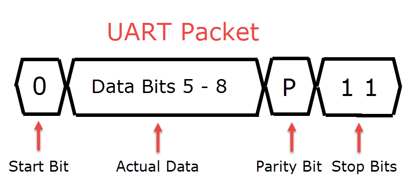

# ECEN 3360 Final Project

## Introduction

In this project, we seek to accomplish a very simple task: find the speed of a spinning bicycle tire, and come up with a useful way to display that information on a phone. We decided to use the NXP LPC1115 along with a Bluetooth UART transmitter to send the speed to a smartphone. We originally had planned on using the MPU-6050 I2C gyroscope to acquire angular velocity data, but after a late-stage transition, we decided on using a infrared photodiode combined with an infrared LED to find a period and calculate out the velocity on the board using some simple calculations. Our original timetable is below:

| Date         | Checkpoint                            |
| ------------ | ------------------------------------- |
| Apr 12, 2018 | Accurately reporting gyroscope values |
| Apr 24, 2018 | Accurately reporting linear velocity  |
| May 1, 2018  | Bluetooth communication working       |
| May 8, 2018  | Final Product                         |
| May 9, 2018  | Final Report                          |

With the addition of a few goals (namely, the inclusion of laser cutting acrylic for component housing), and the transition of some others (the aforementioned pivot to infrared technology), this timetable proved more flexible than originally thought

## Background

The Universal asynchronous reciever-transmitter (UART) protocol is one of the bases of communication between components in our project. UART allows two-way serial communication between two devices, and is asynchronous, meaning it does so without a shared clock between the two devices. Instead, the devices operate on predetermined and shared baud rate, which defines the frequency of bits sent across between devices. All characters are sent in a packet, with a configurable size of 5-8 data bits, as well as a start bit, one or two stop bits, and often a parity bit. Since UART lines are by default high voltage, the start bit needs to be low in order to start a transmission. A typical packet looks like the following:

In our project, the UART is transmitted through Bluetooth, with the use of of a UART Bluetooth transmitter as an intermediary between the Android phone and the microcontroller. Bluetooth is too complicated of a standard to explain fully, but it is a wireless communication standard made for short range applications. Bluetooth works over a fixed 2.4 GHz frequency, which means there may be many devices in any given room also operating on the same frequency. Core to the Bluetooth specification, then, is a process called pairing, which allows devices to choose each other

The process that leads to pairing starts with one or both devices advertising, or putting a packet into the air containing information such as the device name and manufacturer, and flags giving the support and intended use of the device. The master device search through the advertising packets, and selects the correct one, often with user inputs. It is at this point that pairing is initiated.

Once the two devices are paired, the master device chooses a profile in which to operate. Profiles are protocol for general use-cases associated with Bluetooth. There are protocols for headsets, medical devices, video distribution, and more, but we're concerned in this project with the Serial Port Profile (SPP), which allows Bluetooth to emulate a traditional RS-232 serial port, and by extension, UART.

On the other end of our project, there is a ultraviolet photodiode and ultraviolet (UV) light emitting diode (LED) pair. The LED emits UV light when put in forward bias, and the photodiode acts as a "receiver;" it overcomes the reverse bias put on it when receiving UV light, and thus starts conducting current.

Finally, there was one technology cut from our project: the I2C gyroscope. I2C is a synchronous master-slave interface where each slave is assigned a unique 7-bit identifier. I2C operates over 8-bit packets, where the first packet in each transmission consists of the device identifier and a single bit indication of whether the master intends to read or write. In the case of the MPU-6050, that is followed by an address indicating which register to read or write. If it is a read, the slave communicates back the read data.

## Design

The data flow of our original design has information coming from the gyroscope and communicating with the microcontroller, where it underwent simple calibration. Then, the calibrated data went out via UART to the Bluetooth transmitter, which relayed the same data over Bluetooth, utilizing the Serial Port Profile. There, the data is displayed on the phone.

This changed slightly with the introduction of the UV photodiode system. Here, we mounted the UV LED to the fork on the bike frame in line to where the photodiode rested on the microcontroller, which is mounted on the wheel. The LED was connected to a power source, also mounted to the frame, in series with an 820 $$\Omega$$ resistor, meaning current of 1.8 $$mA$$:

Our photodiode is in reverse bias with a 3.3 $$V$$ pin on the microcontroller and is followed by a 1 $$M\Omega$$ pull down resistor. To avoid interference from the idle voltage on the input pin, we put a comparator circuit on the output, set to flip at 1.75 voltgis:

This drives a GPIO interrupt on the microcontroller, which records the time since the last GPIO interrupt, utilizing the time count from a 32-bit onboard timer set to interrupt every millisecond. The relevant code is below. 

To house the circuitry we designed, we laser cut  two sheets of acrylic using the laser cutter in the ITLL. We cut out a square for each of the microcontroller, Bluetooth module, MPU-6050, and battery bank seperately on one sheet. We held everything in place using zip ties. on the other sheet, we cut holes for zip ties to attach to the spokes of a bike wheel, and attached the two sheets with velcro. This made it so that we could slide the somponent sheet in and out through the spokes, while everything stayed in place when the bike was moving. A picture can be seen below. 

## Results

In our project, we did accomplish the goal we set out to. We made a bike speedometer that accurately read us the speed the bike was traveling at. Our overall functionality was correct, but we did not complete everything we had hoped. 

We ran into problems with the MPU-6050 module once we used the USB power bank to to power everything. We had the desired functionality when plugged into the debugger, but not without. We were still able to power on the chip, and configure the registers we needed. We also read these configuration registers to check the right values. However, when we read the gyroscope data registers they returned zero values. We weren’t certain of the cause of this, and tried everything we could to diagnose this. Because of these issues, we decided to use an infrared LED and an infrared photodiode sensor to measure the speed of the bike.  

The infrared LED and photdiode pair ex=nded up being fairly accurate. We used an interrupt triggered timer to measure the time between rotations, and had to simply multiply that by a conversion factor. The only problem with this was practicality. When you are outside, there is a lot of infrared light from the sun. When the sun is shining on the photodiod, we get very unpredictable results as the interrupt is constantly being triggered. To alleviate this, we could have made a sun shield for the photodiode, but did not have the time. 

If we were to attempt this project again, we don't think our approach would change drastically. We would want to have more knowledge of the MPU-6050, and figure out why that wasn't working. Other than that, we feel our approach would've worked very well had we gotten it working. We were very pleased with out final product for the time we put in. We estimate that we put in about 20 hours of work into the project. A good portion of that was trying to debug the problems with the MPU-6050, and near the end when we decided to change our aproach to the infrared LED and photodiode pair. 

### Cost Analysis

| Component | Cost |
| -------- | ---- |
| AGS 2600mAh USB Power bank | $7.99 |
| GY-521 MPU-6050 | $4.66 |
| HC-06 Bluetooth Serial Module | $8.99 |
| NXP LPC1115 | $26.57 |
| IR LED | $1.00 |
| IR Sensor | $2.00 |
| Total | 43.22|

## Conclusion
