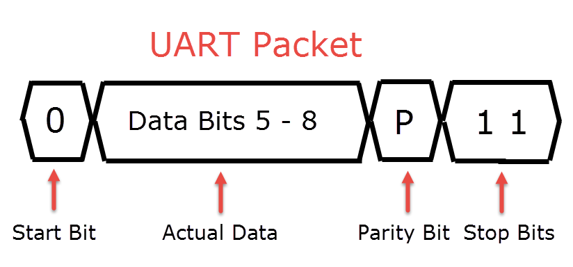

# ECEN 3360 Final Project

## Introduction

In this project, we seek to accomplish a very simple task: find the speed of a spinning bicycle tire, and come up with a useful way to display that information on a phone. We decided to use the NXP LPC1115 along with a Bluetooth UART transmitter to send the speed to a smartphone. We originally had planned on using the MPU-6050 I2C gyroscope to acquire angular velocity data, but after a late-stage transition, we decided on using a infrared photodiode combined with an infrared LED to find a period and calculate out the velocity on the board using some simple calculations. Our original timetable is below:

| Date         | Checkpoint                            |
| ------------ | ------------------------------------- |
| Apr 12, 2018 | Accurately reporting gyroscope values |
| Apr 24, 2018 | Accurately reporting linear velocity  |
| May 1, 2018  | Bluetooth communication working       |
| May 8, 2018  | Final Product                         |
| May 9, 2018  | Final Report                          |

With the addition of a few goals (namely, the inclusion of laser cutting acrylic for component housing), and the transition of some others (the aforementioned pivot to infrared technology), this timetable proved more flexible than originally thought

## Background

The Universal asynchronous reciever-transmitter (UART) protocol is one of the bases of communication between components in our project. UART allows two-way serial communication between two devices, and is asynchronous, meaning it does so without a shared clock between the two devices. Instead, the devices operate on predetermined and shared baud rate, which defines the frequency of bits sent across between devices. All characters are sent in a packet, with a configurable size of 5-8 data bits, as well as a start bit, one or two stop bits, and often a parity bit. Since UART lines are by default high voltage, the start bit needs to be low in order to start a transmission. A typical packet looks like the following:

In our project, the UART is transmitted through Bluetooth, with the use of of a UART Bluetooth transmitter as an intermediary between the Android phone and the microcontroller. Bluetooth is too complicated of a standard to explain fully, but it is a wireless communication standard made for short range applications. Bluetooth works over a fixed 2.4 GHz frequency, which means there may be many devices in any given room also operating on the same frequency. Core to the Bluetooth specification, then, is a process called pairing, which allows devices to choose each other

The process that leads to pairing starts with one or both devices advertising, or putting a packet into the air containing information such as the device name and manufacturer, and flags giving the support and intended use of the device. The master device search through the advertising packets, and selects the correct one, often with user inputs. It is at this point that pairing is initiated.

Once the two devices are paired, the master device chooses a profile in which to operate. Profiles are protocol for general use-cases associated with Bluetooth. There are protocols for headsets, medical devices, video distribution, and more, but we're concerned in this project with the Serial Port Profile (SPP), which allows Bluetooth to emulate a traditional RS-232 serial port, and by extension, UART.

On the other end of our project, there is a ultraviolet photodiode and ultraviolet (UV) light emitting diode (LED) pair. The LED emits UV light when put in forward bias, and the photodiode acts as a "receiver;" it overcomes the reverse bias put on it when receiving UV light, and thus starts conducting current.

Finally, there was one technology cut from our project: the I2C gyroscope. 

## Results

In our project, we did accomplish the goal we set out to. We made a nike spedometer that accurately read us the speed the bike was traveling at. Our overall functionality was correct, but we did run not complete everything we had hoped. 

We ran into problems with the MPU-6050 module once we used the USB power bank to to power everything. We had the desired functionality when plugged into the debugger, but not without. We were still able to power on the chip, and configure the registers we needed. We also read these configuration registers to check the right values. However, when we read the gyroscope data registers they returned zero values. We weren’t certain of the cause of this, and tried everything we could to diagnose this. Instead of this, we used an infrared LED, and an infrared sensor to measure the speed of the bike.  

We also were not able to get the bluetooth app working on our phone. We could not get the communication working between the phone’s bluetooth, and the app itself. Because of this, we simply used an already existing bluetooth serial communication app. 

### Cost Aalysis

| Compnent | Cost |
| -------- | ---- |
| AGS 2600mAh USB Power bank | $7.99 |
| GY-521 MPU-6050 | $4.66 |
| HC-06 Bluetooth Serial Module | $8.99 |
| NXP LPC1115 | $26.57 |
| IR LED | $1.00 |
| IR Sensor | $2.00 | 
| Total | 43.22| 

